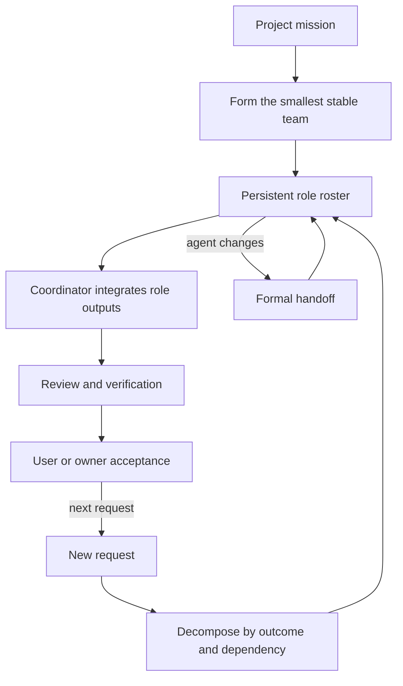

# Agent Teamworks

[English](README.md) | [简体中文](README.zh-CN.md)

> Persistent roles. Shared context. One outcome.

Agent Teamworks is an open-source operating system for persistent multi-agent teams working on real projects.

It keeps the **team stable while the work changes**: a project establishes durable roles once, decomposes each new request according to its actual outcomes and dependencies, and routes that work into the existing team. A concrete agent can be replaced; its logical role, responsibility, history, and open obligations continue through a formal handoff.

## Why it exists

Most multi-agent patterns optimize one prompt: split a task, run several agents, collect answers, and discard the group. That is useful for short parallel work, but weak for a project that evolves over weeks or months.

Agent Teamworks adds the missing project layer:

| Short-lived delegation | Agent Teamworks |
|---|---|
| Agents are created around one request | A team is formed around a project mission |
| Identity disappears after the task | Logical roles persist across work items |
| Context lives mainly in chat history | Team state, decisions, and handoffs are durable records |
| Work is split to maximize parallelism | Work is split by outcome, dependency, ownership, and evidence |
| Agent completion may look like project completion | Review, verification, and user acceptance stay distinct |

## How it works



The coordinator is the primary integration point and usually the user's main interface. It maintains the work graph and routes outcomes to persistent roles. Roles keep bounded ownership and return evidence; they do not become disconnected mini-projects.

## Start here

1. Read the [operating model](framework/operating-model.md).
2. Use the [formation protocol](protocols/team-formation.md) to decide whether a team is justified and create the smallest useful roster.
3. Store project state under `.agent-teamworks/` using the [schemas](schemas/).
4. Follow [work routing](protocols/work-routing.md) for each new request and [handoff](protocols/handoff.md) whenever an agent binding changes.
5. Keep [product experience acceptance, technical review, delivery readiness, and merge authorization](protocols/review-and-acceptance.md) as separate states.

The [fictional commerce example](examples/commerce-project/) demonstrates a five-role team, dependency-based routing, pending product experience acceptance, and agent succession without exposing any real project state.

## Project structure

```text
agent-teamworks/
├── framework/          # Operating model and lifecycle
├── roles/              # Reusable role-contract guidance
├── protocols/          # Formation, routing, handoff, acceptance, escalation
├── schemas/            # Team, Role, Work Item, Handoff, Decision
├── adapters/codex/     # Runtime mapping for Codex
├── skills/             # Thin Skill entry points
├── examples/           # Sanitized project instances
├── evals/              # Behavioral forward-evaluation cases
└── tests/              # Schema and consistency checks
```

The framework is the source of truth. Skills and runtime adapters are deliberately thin so the collaboration method can evolve without being trapped in one platform.

## Codex Skill

The repository includes a discoverable Skill at [`skills/agent-teamworks`](skills/agent-teamworks/). Keep the full repository checkout available when installing the Skill because its entry point links back to the framework and protocols.

Agent Teamworks complements software-delivery workflows such as `agentic-orchestrate-delivery`: Agent Teamworks owns persistent team formation and continuity; a delivery workflow owns the Spec, Plan, implementation, review, verification, and Git path for a particular software outcome.

## Validate

```bash
python3 -m venv .venv
.venv/bin/pip install -r requirements-dev.txt
.venv/bin/python scripts/validate.py
```

The checks validate all schemas, example records, cross-record references, work dependencies, succession continuity, public-example safety markers, Skill metadata, and local documentation links.

## Status

V0.2 extends the foundation with separate product experience acceptance, technical review, delivery readiness, and merge authorization gates. [Work Item Schema `0.2.0`](docs/migrations/work-item-0.2.0.md) records those states explicitly; unchanged record schemas retain their own `0.1.0` versions. Agent Teamworks intentionally does not include a hosted runtime, dashboard, or complex CLI. Those should emerge only after repeated project use demonstrates a concrete need.

## Contributing

Changes follow branch → pull request → review → explicit merge so the method's evolution remains traceable. See [CONTRIBUTING.md](CONTRIBUTING.md).

## License

[MIT](LICENSE)
