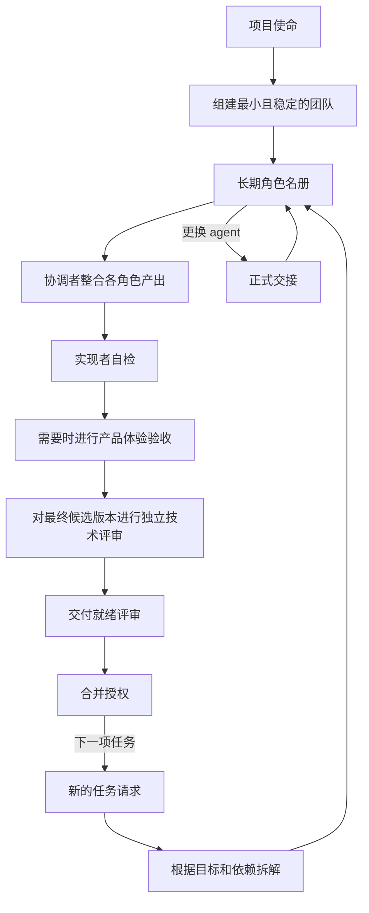

# Agent Teamworks

[English](README.md) | 简体中文

> 角色常驻。上下文共享。成果一致。

Agent Teamworks 是一套面向真实项目的开源多智能体团队协作系统。

它的核心是：**工作不断变化，团队保持稳定**。项目只需要建立一次长期角色体系；每当新任务出现时，再根据实际目标和依赖关系进行拆解，并把工作路由给现有团队。具体的 agent 可以更换，但它所承担的逻辑角色、责任、历史记录和未完成义务，会通过正式交接持续保留。

## 为什么需要它

多数多智能体模式主要优化一次提示词：拆分任务、启动多个 agent、收集结果，然后解散临时团队。这适合短期并行工作，却难以支撑持续数周或数月、不断演进的完整项目。

Agent Teamworks 补上了项目层的协作机制：

| 短期任务委派 | Agent Teamworks |
|---|---|
| 围绕一次请求临时创建 agent | 围绕项目使命建立长期团队 |
| 任务结束后身份随之消失 | 逻辑角色在不同工作项之间持续存在 |
| 上下文主要留在聊天记录里 | 团队状态、决策和交接形成持久记录 |
| 为了提高并行度而拆分工作 | 根据目标、依赖、所有权和证据拆分工作 |
| agent 完成容易被误认为项目完成 | 产品体验验收、技术评审、交付就绪和合并授权始终相互独立 |

## 如何运作



协调者是团队的主要整合节点，通常也是用户唯一需要直接面对的入口。协调者维护工作关系图，并把不同结果路由给对应的长期角色。各角色在明确边界内承担责任、提交产出与证据，而不是演变成彼此失联的小项目。

## 从这里开始

1. 阅读[团队运行模型](framework/operating-model.md)。
2. 使用[团队组建协议](protocols/team-formation.md)判断项目是否确实需要多智能体团队，并建立最小可用角色体系。
3. 根据项目 [Schema](schemas/) 把团队状态保存在 `.agent-teamworks/` 目录中。
4. 每次收到新任务时遵循[工作路由协议](protocols/work-routing.md)；更换 agent 绑定时遵循[交接协议](protocols/handoff.md)。
5. 配置[通信与续跑协议](protocols/communication.md)：明确回传地址、接收方式、恢复责任人，以及结果到达后由协调者整合并派发下一步。参见[虚构通信示例](examples/communication-walkthrough.md)。
6. 始终把[产品体验验收、技术评审、交付就绪和合并授权](protocols/review-and-acceptance.md)作为四个独立状态管理。

[虚构电商项目示例](examples/commerce-project/)展示了一个五角色团队、基于依赖关系的工作路由、尚未完成的产品体验验收，以及在不改变逻辑角色的情况下完成 agent 接续。示例不包含任何真实项目状态。

## 项目结构

```text
agent-teamworks/
├── framework/          # 团队运行模型与生命周期
├── roles/              # 可复用的角色契约指南
├── protocols/          # 组建、路由、交接、验收与升级协议
├── schemas/            # Team、Role、Work Item、Handoff、Decision
├── adapters/codex/     # Codex 运行时映射
├── skills/             # 轻量 Skill 入口
├── examples/           # 脱敏后的项目实例
├── evals/              # 协作行为评估场景
└── tests/              # Schema 与一致性检查
```

框架内容是这套方法的事实来源。Skill 和运行时适配层刻意保持轻量，使协作机制可以持续演进，而不会被限制在某一个平台中。

## Codex Skill

项目内置了可发现的 [`agent-teamworks` Skill](skills/agent-teamworks/)。安装时应保留完整的仓库目录，因为 Skill 入口会继续引用框架和协议文件。

Agent Teamworks 可以与 `agentic-orchestrate-delivery` 等软件交付流程配合使用：Agent Teamworks 负责长期团队的组建、角色延续和工作路由；软件交付流程负责某一项具体结果的 Spec、Plan、实现、审查、验证、Git 交付和验收闭环。

## 验证

```bash
python3 -m venv .venv
.venv/bin/pip install -r requirements-dev.txt
.venv/bin/python scripts/validate.py
```

检查内容包括所有 Schema、示例记录、跨记录引用、工作依赖、角色接续、公开样例安全标记、Skill 元数据和本地文档链接。

## 当前状态

V0.2 在既有基础上增加了相互独立的产品体验验收、技术评审、交付就绪和合并授权门槛。[Work Item Schema `0.2.0`](docs/migrations/work-item-0.2.0.md) 会显式记录这些状态；未发生变化的其他记录 Schema 继续保留各自的 `0.1.0` 版本。目前仍刻意不包含托管运行时、仪表盘或复杂 CLI；这些能力只应在更多真实项目反复使用并证明存在明确需求后再加入。

## 参与贡献

项目采用“分支 → Pull Request → 审查 → 明确授权合并”的方式推进，使这套方法的演进过程始终可追溯。具体参见 [CONTRIBUTING.md](CONTRIBUTING.md)。

## 许可证

[MIT](LICENSE)
