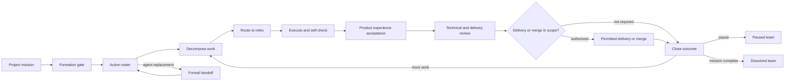

# Operating Model

Agent Teamworks is a project operating model for a persistent multi-agent team. It is useful when a project spans multiple dependent outcomes, needs distinct responsibilities, or will continue long enough that role continuity matters.

Do not form a team for a single clear edit, a short read-only question, or work that cannot yet be decomposed without a consequential product decision.

## The two layers

Agent Teamworks separates durable project responsibility from disposable runtime capacity:

| Layer | Persists | May change |
|---|---|---|
| Logical team | Mission, authority, roster, role identities, records, obligations | Lifecycle state and roster through recorded decisions |
| Agent runtime | The concrete task, thread, process, or model bound to a role | May be replaced after a complete handoff |

This distinction is the core continuity mechanism. A role does not disappear when its current agent stops running.

## Core records

- **Team:** project mission, lifecycle, coordinator, roster, and authority boundary.
- **Role:** stable responsibility, owned boundaries, decisions, escalation rules, and current binding generation.
- **Work Item:** one observable outcome with dependencies, owner, evidence, and acceptance state.
- **Handoff:** explicit transfer of current truth, evidence, open obligations, and ownership.
- **Decision:** proposed or authorized choice with rationale, evidence, and supersession history.

Keep these records in the project under `.agent-teamworks/` or an equivalent versioned project-state directory. Repository files are the durable source; chat history alone is not.

## Lifecycle



### 1. Establish the mission

Record the intended project outcome, non-goals, observable success, constraints, authority owner, and required acceptance path. Do not form a team around an undefined wish list.

### 2. Pass the formation gate

Form the smallest stable roster that covers durable responsibility boundaries. Each role needs a unique ID, a purpose, owned boundaries, authority, escalation triggers, and a continuity location.

The coordinator role is required. Other roles exist only when the mission creates an ongoing responsibility that should survive multiple work items.

### 3. Activate the roster

Bind at most one active agent to each role. Record the binding reference and generation. Confirm that role boundaries do not create conflicting ownership of the same mutable state.

### 4. Decompose and route work

Split new work by observable outcome, dependencies, shared interfaces, mutable ownership, evidence, and acceptance needs. Then route each work item to an existing role.

Create a new role only when repeated or upcoming work reveals a durable responsibility gap. A single task does not automatically justify a role.

### 5. Execute through the team

The coordinator maintains the integrated view. Roles own bounded outcomes, preserve shared state, and return concise status and evidence. A role report is input to integration, not proof that the project is complete.

Before dispatching independent runtimes, establish [communication and continuation](../protocols/communication.md). The coordinator owns receipt, integration, and the next routing action as well as the work graph. It must not end a turn with outstanding work and no supported continuation route or explicit continuity limitation.

### 6. Accept, review, and authorize delivery

For a user-visible outcome, the user or designated acceptance owner first decides whether the runnable candidate satisfies product direction, business semantics, information hierarchy, workflow, and real use. A product review advisor may advise but does not own that decision.

After required product acceptance, the coordinator routes the final candidate HEAD through independent technical and delivery review. Record `PASS` or `NEEDS_FIX` for technical review and `MERGE_READY` or `NEEDS_FIX` for delivery readiness. Merge authorization remains a fourth independent state governed by project permissions.

If accepted user-visible behavior changes, repeat acceptance only for the affected scope. A purely technical fix still requires independent technical re-review. Green checks, product acceptance, `PASS`, and `MERGE_READY` never imply one another or imply merge permission.

### 7. Preserve continuity

When an agent binding changes, complete a handoff, increment the binding generation, and keep the same logical role ID. If ownership itself changes, record a decision and a role-to-role handoff.

### 8. Pause or dissolve deliberately

Pause a team when its mission remains valid but active work stops. Dissolve it only when the mission is complete or explicitly cancelled. Record unresolved work, retained decisions, final acceptance state, and any future restart condition.

## Operating invariants

1. One active coordinator is the user-facing integration point.
2. One active binding owns each role.
3. One role owns each mutable boundary at a time.
4. Work decomposition follows outcomes and dependencies, not a desired agent count.
5. Existing roles receive new work before the roster expands.
6. Consequential decisions and state transitions are durable and attributable.
7. Agent replacement uses handoff; it never creates an unrecorded duplicate owner.
8. Implementers do not approve their own work.
9. Product acceptance, technical `PASS`, `MERGE_READY`, and merge authorization are independent states.
10. Verification proves only the claims it observes.
11. Product experience acceptance is explicit when the outcome affects a user workflow.

## Minimum viable adoption

A project can begin with:

```text
.agent-teamworks/
├── team.json
├── roles/
├── work-items/
├── decisions/
└── handoffs/
```

Start with a coordinator and only the roles justified by the current mission. Add protocols and automation as real usage reveals a recurring need.
